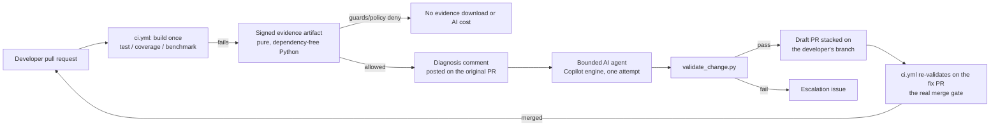

# Self-Healing CI/CD Demo

A small, complete, working demonstration of combining **deterministic
GitHub Actions** with **bounded GitHub Agentic Workflows (AI)** to detect,
classify, and remediate a CI failure on a **real developer pull request**
— without ever letting the AI decide on its own that it's allowed to act,
and without it ever merging anything.

This is a demo repository, built to be **simple, reliable, and repeatable**,
not a production framework. It intentionally does not implement adapters to
external systems (ticketing, chat, paging) — see
[`docs/architecture.md`](docs/architecture.md#why-no-external-adapters).

## The loop



See [`docs/architecture.md`](docs/architecture.md) for the full diagram,
layer-by-layer description, and documented known limitations.

## What's being "healed"

A small C++17 "engineering job processor" (`src/`, `include/`, `app/`) with
11 unit tests, 100% line coverage, and a deterministic performance
benchmark on a healthy `main`. The pipeline is **category-driven**, not
scenario-driven: any real developer change that trips one of three
deterministic checks is detected, classified, and (if policy allows)
remediated the same way. Three optional fixtures exist purely as repeatable
demo helpers, each a plain git patch introducing exactly one classified
defect:

| Fixture | What breaks | Failure category | Agent may touch |
|---|---|---|---|
| `easy-unit-test` | Removes an empty-input guard → one test fails | `unit-test-failure` | `src/`, `include/` |
| `medium-low-coverage` | Adds two untested branches → coverage drops below 95% | `coverage-gap` | `tests/` (test-only remediation) |
| `advanced-performance` | Swaps an O(n) algorithm for O(n²) → benchmark exceeds 200ms | `performance-regression` | `src/`, `include/` |

Full details, including exact expected test/measurement outcomes, are in
each `fixtures/<scenario>/metadata.json`. **The remediation workflow never
applies a fixture itself** — it only ever reacts to a real CI failure on a
real pull request, however that failure was introduced.

## Quickstart

```sh
make build                      # configure + build
make test                       # 11/11 unit tests
make coverage                   # 100% line coverage, 95% threshold
make benchmark                  # ~5ms median, 200ms threshold
make automation-test            # Python test suite covering the framework itself
make public-check               # scan tracked files for secrets/internal references

make apply-easy                 # introduce the easy-unit-test defect locally
make test                       # watch it fail
make reset SCENARIO=easy-unit-test   # back to a clean baseline

make demo-pr-easy                # or demo-pr-medium / demo-pr-advanced:
                                  # opens a real branch + commit + pull request
                                  # so the full PR-driven demo can run end to end
```

See [`docs/demo-guide.md`](docs/demo-guide.md) for the full walkthrough,
including how to trigger the real agentic workflow
(`.github/workflows/self-heal-remediation.md`) and what to expect from each
failure category.

## Repository layout

```
app/, src/, include/        C++17 application under demonstration
tests/                      CTest unit tests + the custom test framework
benchmarks/                 Deterministic performance benchmark
fixtures/<scenario>/        Optional demo-helper patch + metadata.json per scenario
framework/schemas/          Evidence JSON Schema + dependency-free validator
scripts/                    Evidence collection, classification, policy,
                             loop-prevention guards, validation, demo fixture
                             apply/reset/submit-pr, public-repo scan,
                             universal forbidden-path CI guard
tests/automation/           Python test suite for the framework itself
.github/policies/           Authoritative, human-reviewed, category-driven policy YAML
.github/workflows/ci.yml    Deterministic CI: build once, test/coverage/benchmark,
                             always-collect-evidence, automation tests,
                             public-repo scan, policy guard
.github/workflows/self-heal-remediation.md   The one agentic workflow,
                             triggered by a failed CI workflow_run
AGENTS.md                   Remediation agent's authoritative instructions
docs/                        Architecture, evidence contract, demo guide,
                             extension guide
Makefile                    Local developer entry points for every script above
```

## Repository setup (for running the real agentic demo)

1. Push to a public GitHub repository with Actions enabled.
2. Ensure the account/organization running the workflow has Copilot coding
   agent access enabled, since `.github/workflows/self-heal-remediation.md`
   uses `engine: copilot`.
3. Create a
   [fine-grained personal access token](https://github.com/settings/personal-access-tokens/new?name=COPILOT_GITHUB_TOKEN&description=GitHub+Agentic+Workflows+-+Copilot+engine+authentication&user_copilot_requests=read)
   owned by your user account with **Account permissions → Copilot Requests →
   Read**, then save it as a repository Actions secret:

   ```sh
   gh secret set COPILOT_GITHUB_TOKEN
   gh secret list --app actions
   ```

   The first command securely prompts for the `github_pat_...` value. OAuth
   (`gho_...`) and classic (`ghp_...`) tokens are not accepted. Confirm that
   the second command lists the exact, case-sensitive secret name before
   running the workflow.
4. (Recommended) Add branch protection on `main` requiring the `build-test`
   and `policy-guard` jobs from `ci.yml` as required status checks — this is
   the actual merge gate described in `docs/architecture.md`.
5. Open a real pull request. The fastest repeatable way is
   `make demo-pr-easy` (or `-medium`/`-advanced`), which creates a normal
   branch, commit, and pull request from a fixture via the `gh` CLI — CI is
   expected to fail on it, and `self-heal-remediation` should then react
   automatically. See `docs/demo-guide.md` for the full walkthrough.
6. If you edit `.github/workflows/self-heal-remediation.md`, recompile with
   [`gh aw compile`](https://github.com/githubnext/gh-aw) and commit the
   regenerated `.lock.yml` in the same commit.

## Design principles

- **Deterministic first.** Every failure is detected and classified by
  plain scripts with no AI involved; the AI only ever runs after
  loop-prevention guards and a deterministic policy decision say it's in
  scope.
- **PR-driven, not scenario-driven.** The pipeline reacts to real
  developer pull requests and real CI failures. Fixtures are an optional
  convenience for producing a repeatable demo PR; the remediation workflow
  never applies one itself and cannot tell a fixture-introduced defect from
  a hand-written one.
- **Fail closed.** Missing or unsigned evidence, a stale or fork-originated
  trigger, a remediation-branch loop, a duplicate attempt, an unrecognized
  failure category, or a change touching a forbidden path all deny
  remediation — they never default to "allow."
- **One bounded attempt.** The policy engine rejects any attempt beyond the
  first; there is no retry loop that could spiral in cost or scope.
- **The AI never merges.** Safe-outputs are limited to a draft pull request
  stacked on the developer's own branch, or an escalation issue. The actual
  merge gate is an ordinary required CI check on that PR, identical to what
  a human contributor would face.
- **No secrets, no customer data, nothing internal.** Verified by
  `scripts/check_public_repo.py`, which also runs in CI on every push/PR.

## License

MIT — see [`LICENSE`](LICENSE).

## Security

See [`SECURITY.md`](SECURITY.md) for how to report a vulnerability.
