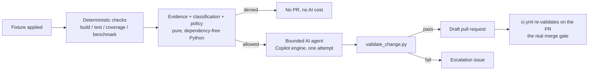

# Self-Healing CI/CD Demo

A small, complete, working demonstration of combining **deterministic
GitHub Actions** with **bounded GitHub Agentic Workflows (AI)** to detect,
classify, and remediate a CI failure — without ever letting the AI decide
on its own that it's allowed to act, and without it ever merging anything.

This is a demo repository, built to be **simple, reliable, and repeatable**,
not a production framework. It intentionally does not implement adapters to
external systems (ticketing, chat, paging) — see
[`docs/architecture.md`](docs/architecture.md#why-no-external-adapters).

## The loop



See [`docs/architecture.md`](docs/architecture.md) for the full diagram,
layer-by-layer description, and documented known limitations.

## What's being "healed"

A small C++17 "engineering job processor" (`src/`, `include/`, `app/`) with
11 unit tests, 100% line coverage, and a deterministic performance
benchmark on a healthy `main`. Three fixtures, each a plain git patch,
introduce exactly one classified defect:

| Scenario | What breaks | Failure category | Agent may touch |
|---|---|---|---|
| `easy-unit-test` | Removes an empty-input guard → one test fails | `unit-test-failure` | `src/job_processor.cpp`, `include/job_processor.hpp` |
| `medium-low-coverage` | Adds two untested branches → coverage drops below 95% | `coverage-gap` | `tests/` (extends an existing test's body — see below) |
| `advanced-performance` | Swaps an O(n) algorithm for O(n²) → benchmark exceeds 200ms | `performance-regression` | `src/job_processor.cpp`, `include/job_processor.hpp` |

Full details, including exact expected test/measurement outcomes, are in
each `fixtures/<scenario>/metadata.json`.

## Quickstart

```sh
make build                      # configure + build
make test                       # 11/11 unit tests
make coverage                   # 100% line coverage, 95% threshold
make benchmark                  # ~5ms median, 200ms threshold
make automation-test            # 40 Python tests covering the framework itself
make public-check               # scan tracked files for secrets/internal references

make apply-easy                 # introduce the easy-unit-test defect
make test                       # watch it fail
make reset SCENARIO=easy-unit-test   # back to a clean baseline
```

See [`docs/demo-guide.md`](docs/demo-guide.md) for the full walkthrough,
including how to trigger the real agentic workflow
(`.github/workflows/self-heal-remediation.md`) and what to expect from each
scenario.

## Repository layout

```
app/, src/, include/        C++17 application under demonstration
tests/                      CTest unit tests + the custom test framework
benchmarks/                 Deterministic performance benchmark
fixtures/<scenario>/        One patch + metadata.json per scenario
framework/schemas/          Evidence JSON Schema + dependency-free validator
scripts/                    Evidence collection, classification, policy,
                             validation, demo fixture apply/reset, public-repo
                             scan, universal forbidden-path CI guard
tests/automation/           Python test suite for the framework itself (40 tests)
.github/policies/           Authoritative, human-reviewed policy YAML
.github/workflows/ci.yml    Deterministic CI: build/test/coverage/benchmark
                             + automation tests + public-repo scan + policy guard
.github/workflows/self-heal-remediation.md   The one agentic workflow
AGENTS.md                   Remediation agent's authoritative instructions
docs/                        Architecture, evidence contract, demo guide,
                             extension guide
Makefile                    Local developer entry points for every script above
```

## Repository setup (for running the real agentic demo)

1. Push to a public GitHub repository with Actions enabled.
2. Ensure the account/organization running the workflow has Copilot coding
   agent access enabled, since `.github/workflows/self-heal-remediation.md`
   uses `engine: copilot`.
3. (Recommended) Add branch protection on `main` requiring the `build-test`
   and `policy-guard` jobs from `ci.yml` as required status checks — this is
   the actual merge gate described in `docs/architecture.md`.
4. Trigger a scenario:
   `gh workflow run self-heal-remediation.lock.yml -f scenario=easy-unit-test`.
5. If you edit `.github/workflows/self-heal-remediation.md`, recompile with
   [`gh aw compile`](https://github.com/githubnext/gh-aw) and commit the
   regenerated `.lock.yml` in the same commit.

## Design principles

- **Deterministic first.** Every failure is detected and classified by
  plain scripts with no AI involved; the AI only ever runs after a
  deterministic policy decision says it's in scope.
- **Fail closed.** Missing evidence, an unrecognized failure category, or a
  change touching a forbidden path all deny remediation — they never
  default to "allow."
- **One bounded attempt.** The policy engine rejects any attempt beyond the
  first; there is no retry loop that could spiral in cost or scope.
- **The AI never merges.** Safe-outputs are limited to a draft pull request
  or an escalation issue. The actual merge gate is an ordinary required CI
  check on the PR, identical to what a human contributor would face.
- **No secrets, no customer data, nothing internal.** Verified by
  `scripts/check_public_repo.py`, which also runs in CI on every push/PR.

## License

MIT — see [`LICENSE`](LICENSE).

## Security

See [`SECURITY.md`](SECURITY.md) for how to report a vulnerability.
