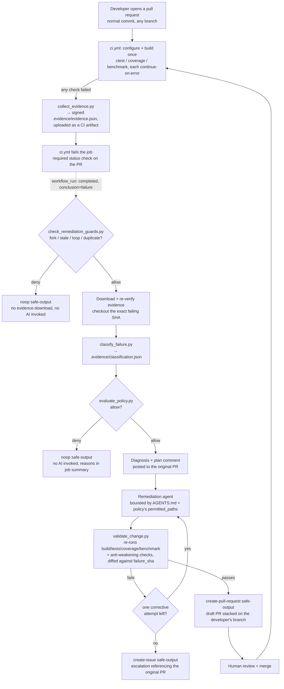

# Architecture

## Goal

Show a complete, working, minimal "self-healing CI/CD" loop driven entirely
by **real developer pull requests**: deterministic CI detects and classifies
a failure, a deterministic policy engine decides whether automated
remediation is in scope, a concise diagnosis is posted back to the
developer's own pull request, and only then is a tightly bounded AI agent
invoked to propose a fix — which a deterministic validator re-checks before
opening a **draft pull request stacked on top of the developer's own
branch**. A human reviews and merges that fix PR like any other; merging it
reruns CI on the original pull request and turns it green. The AI is never
the thing that decides it's allowed to act, it never merges anything, and it
never even runs unless a real CI failure on a real pull request produced
signed evidence that policy accepted.

This repository intentionally keeps the loop to three failure *categories*
(not a fixed list of scenario ids — any real developer change can trigger
one) and does **not** implement pluggable "event adapters" for arbitrary
external systems (ticketing, chat, paging, etc.) — see
["Why no external adapters"](#why-no-external-adapters) below.

## The pipeline, end to end

Note the loop closes back into `ci.yml`: merging the stacked fix PR into the
developer's branch is itself a normal push, which reruns `ci.yml` on the
original pull request and, if the fix is genuinely correct, turns it green —
there is no separate "merge gate" invented for remediation PRs; they go
through the exact same required status checks as any human-authored change.

## Layers

1. **Deterministic application layer** (`src/`, `include/`, `app/`,
   `tests/`, `benchmarks/`) — a small C++17 "engineering job processor" with
   11 named unit tests, 100% line coverage on a healthy `main`, and a
   deterministic performance benchmark. This is the thing that's supposedly
   being maintained; it is only complex enough to host three distinct,
   realistic defect classes.

2. **CI** (`.github/workflows/ci.yml`) — configures and builds **once**,
   then runs the three deterministic checks (unit tests, coverage, the
   benchmark) each with `continue-on-error: true` so every check always
   runs regardless of earlier failures. It **always** collects and
   normalizes evidence (`scripts/collect_evidence.py`) and uploads it as a
   build artifact before a final assertion step fails the job based on the
   three checks' actual outcomes — evidence is produced unconditionally on
   failure, never only for whichever failure happened to be "first."
   `timeout-minutes: 5`.

3. **Loop-prevention guards** (`scripts/check_remediation_guards.py`) — a
   pure, unit-tested function evaluated as the very first deterministic
   steps of the remediation workflow, before any evidence is even
   downloaded or any AI model invoked. It denies the run unless: the
   triggering workflow run was a `pull_request`-event failure; GitHub
   populated `workflow_run.pull_requests` with a same-repository PR (empty
   for forks — forks are rejected at this layer, on top of the fork/
   repository-ID checks gh-aw's compiler already injects for
   `workflow_run:` triggers); the pull request's head branch does not
   already start with `remediation_branch_prefix` (refusing to remediate a
   remediation branch's own, by-design-red, CI run); the triggering run's
   head SHA still matches the pull request's *current* live head SHA (not
   stale — the developer hasn't pushed since); and no remediation
   branch/PR already exists for this head SHA (no duplicates).

4. **Evidence, classification, and policy** (`scripts/collect_evidence.py`,
   `scripts/classify_failure.py`, `scripts/evaluate_policy.py`,
   `.github/policies/self-heal-policy.yml`) — pure, dependency-free Python,
   category-driven (`unit-test-failure` / `coverage-gap` /
   `performance-regression`), never scenario-driven: a real pull request can
   touch any file, so policy describes what's permitted *for a failure
   category*, not for a fixed list of demo scenario ids. None of this calls
   an AI model. See `docs/evidence-contract.md` for the evidence schema and
   `.github/policies/self-heal-policy.yml` for the authoritative
   per-category rules (permitted/forbidden paths, max diff size, max
   attempts, runtime budget).

5. **Diagnosis comment** — a deterministic step posts a concise summary of
   the evidence, classification, and policy decision to the **original**
   pull request (not the remediation workflow's own run) as soon as policy
   allows remediation, *before* the AI agent is invoked — so a human
   watching the PR sees what's about to happen and why, independent of
   whether the agent ultimately succeeds.

6. **The remediation agent** (`.github/workflows/self-heal-remediation.md`,
   `AGENTS.md`) — a single GitHub Agentic Workflow (Copilot engine),
   triggered by `workflow_run` when `ci.yml` completes with conclusion
   `failure`. All of layers 3–5 run as deterministic `steps:` inside the
   same job, *before* the AI engine starts; if any of them deny the run,
   the workflow writes a `noop` safe-output and the AI is never invoked (no
   AI Credits spent, no evidence downloaded in the guard-denial case). If
   everything allows, the agent checks out the exact failing commit, is
   hard-instructed (`AGENTS.md`) to only ever touch the category's
   `permitted_paths`, to run `scripts/validate_change.py` itself before
   proposing anything, and to escalate via `create-issue` (referencing the
   original PR) instead of opening a pull request if it cannot produce a
   validated fix within its one attempt. `timeout-minutes: 10`.
   Concurrency is keyed by PR number + head SHA, so a second CI failure on
   the same commit (or a retriggered workflow run) can't start a second,
   overlapping remediation attempt.

7. **Validation and the stacked fix PR** (`scripts/validate_change.py`) —
   re-runs the same deterministic checks plus "anti-weakening" checks
   (forbidden-path scope, diff size, required tests still present and
   passing) and is the gate the agent is instructed to honor before
   opening a PR. On success, the agent opens a **draft** pull request whose
   base branch is the *developer's own branch* (a stacked PR, via gh-aw's
   `create-pull-request` `base-branch`/`stacked` safe-output options), never
   `main`. Merging that fix PR updates the developer's branch, which
   reruns `ci.yml` there and, if the fix is genuinely correct, turns the
   original pull request green — there is no separate merge mechanism
   invented for remediation; `ci.yml`'s required status checks are the
   real, final gate for every pull request, human-authored or AI-authored.

## Two distinct diff bases in `validate_change.py`

Patch-scope and anti-weakening checks always diff the remediation against
`evidence.head_sha` — the exact failing commit the agent started from —
**never** against `main` or `evidence.base_sha`. This is deliberate: the
developer's own pull request may itself touch paths that would be forbidden
for the *remediation* to re-touch (for example, their PR might legitimately
edit `Makefile`), so diffing against anything earlier than the failing
commit would incorrectly blame the agent for the developer's own changes.

The `coverage-gap` category's changed-line-coverage check is the one
exception: it diffs against `evidence.base_sha` (the pull request's own
base commit) instead, because the question there is "did the developer's
own new production code get covered by the agent's new tests" — which is
only answerable relative to the PR's own base, not the failing commit.

## Why the final gate is a required CI check, not a gh-aw hook

`create-pull-request` in GitHub Agentic Workflows executes in a separate,
privileged job *after* the agent job finishes — by design, so the
inference-running agent never holds write credentials. That means there is
no reliable hook to veto a specific `create-pull-request` call based on a
custom validation result computed inside the agent's own job. Rather than
fight that boundary, this demo uses the idiomatic, simpler answer: make the
*merge*, not the PR-creation event, the enforcement point. `ci.yml`'s
build/test/coverage/benchmark job and its forbidden-path guard
(`scripts/check_global_forbidden_paths.py`) are ordinary required status
checks, applied to every pull request — the stacked fix PR included,
because it targets the developer's branch and `ci.yml`'s `pull_request:`
trigger has no branch filter. Set up branch protection on `main` (and, if
desired, on long-lived developer branches) requiring these checks, and no
remediation (or human) PR can merge without satisfying every deterministic
check this repository defines — regardless of what the agent did or didn't
self-validate.

## Evidence provenance and tamper-evidence, not a trust boundary

Evidence carries full PR provenance (`repository`, `pr_number`,
`base_branch`/`base_sha`, `head_branch`/`head_sha`, `workflow_run_id`) and a
sha256 `signature` field computed over every other field by
`collect_evidence.py` in the same trusted CI job that measured the failure.
The remediation workflow re-verifies that signature and independently
cross-checks the provenance fields against the live GitHub API (the PR's
*current* head SHA, the triggering run's repository and id) before trusting
the evidence at all. This is **tamper-evidence**, not a cryptographic
non-repudiation guarantee: `.evidence/` is gitignored and produced fresh,
in the same job, immediately before the remediation agent runs, and nothing
stops code running in that same job from hand-editing
`.evidence/evidence.json` and recomputing a matching signature. A
production system should collect evidence in an earlier, separate job (or
workflow), treat it as a read-only artifact signed with a key the
remediation job does not hold, and pass it across that trust boundary. This
demo does not implement that separation, to keep the pipeline to two
easily-inspectable workflows (`ci.yml` and `self-heal-remediation.md`/
`.lock.yml`).

## Known limitations

These are deliberate, documented scope boundaries — not oversights — given
this repository's stated goal of being a **simple, reliable, repeatable
demonstration**, not a production hardening reference:

- **Evidence integrity**, as described above: tamper-evidence via signature
  plus live API cross-checks, not a true cross-trust-boundary artifact.
- **Agent self-validation is advisory, not a hard gate.** The agent is
  instructed (`AGENTS.md`) to run `validate_change.py` before opening a PR,
  but nothing mechanically prevents it from skipping that step. The actual
  hard gate is `ci.yml`'s required status checks on the stacked fix PR (see
  above).
- **No cross-repository or third-party integrations.** This demo
  deliberately does not implement adapters for ticketing systems, chat
  notifications, paging, or any other external service. Everything happens
  with GitHub-native primitives (issues, pull requests, Actions). See
  `docs/extension-guide.md` for where such an adapter would plug in if
  someone wanted to build one later — it is a documented extension point,
  not shipped code.
- **Timing-sensitive thresholds.** The coverage threshold (95%) and
  benchmark threshold (200ms) were tuned and verified locally; CI runs on
  GitHub-hosted Ubuntu runners, which may have different performance
  characteristics than a local machine. The benchmark's margin
  (healthy-path median ~5ms vs. a 200ms threshold) is intentionally large,
  and the performance-remediation validation profile re-runs the benchmark
  3 times and requires 2 of 3 passes, to keep the demo reliable across
  runner variance.
- **Runtime budget.** The end-to-end pipeline (CI failure through a merged
  fix) targets 8–10 minutes and has a 15-minute hard SLA documented in
  `.github/policies/self-heal-policy.yml`'s `runtime_budget_minutes`;
  `ci.yml` and the remediation workflow each additionally enforce their own
  `timeout-minutes` (5 and 10 respectively) so a stuck run fails loudly
  rather than lingering.

## Why no external adapters

An earlier draft of this project considered a generic "event-source
adapter" layer so evidence could, in principle, be produced from a paging
system, a ticketing system, or some other non-GitHub-native signal. That
would meaningfully increase the surface area (new auth, new failure modes,
new things to secure and test) without making the core self-healing loop any
clearer. This repository's explicit goal is a simple, reliable, repeatable
demonstration of the loop itself — so those adapters are out of scope and
are not implemented here, by design.
