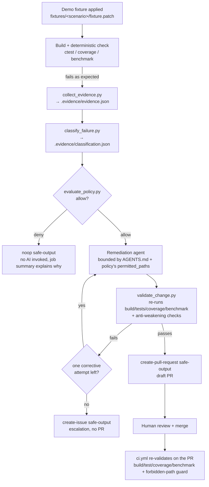

# Architecture

## Goal

Show a complete, working, minimal "self-healing CI/CD" loop: deterministic
tooling detects and classifies a failure, a deterministic policy engine
decides whether automated remediation is in scope, and only then is a
tightly bounded AI agent invoked to propose a fix — which a deterministic
validator re-checks before a human ever sees a pull request to review and
merge. The AI is never the thing that decides it's allowed to act, and it
never merges anything.

This repository intentionally keeps that loop to three concrete scenarios
and does **not** implement pluggable "event adapters" for arbitrary external
systems (ticketing, chat, paging, etc.) — see
["Why no external adapters"](#why-no-external-adapters) below.

## The pipeline, end to end

## Layers

1. **Deterministic application layer** (`src/`, `include/`, `app/`,
   `tests/`, `benchmarks/`) — a small C++17 "engineering job processor" with
   11 named unit tests, 100% line coverage on a healthy `main`, and a
   deterministic performance benchmark. This is the thing that's supposedly
   being maintained; it is only complex enough to host three distinct,
   realistic defect classes.

2. **Fixtures** (`fixtures/<scenario>/fixture.patch` +
   `metadata.json`) — three small, auditable, hand-written unified diffs,
   each one introducing exactly one classified defect:
   - `easy-unit-test`: removes an empty-input guard, causing one specific
     unit test to fail (`unit-test-failure`).
   - `medium-low-coverage`: adds two new, legitimately untested branches,
     dropping coverage below the 95% threshold (`coverage-gap`).
   - `advanced-performance`: changes an O(n) duplicate-finding algorithm to
     O(n²), pushing the benchmark well past its threshold
     (`performance-regression`).

   Fixtures are applied with `scripts/create_demo_failure.py` and reverted
   with `scripts/reset_demo.py`; they are plain `git apply`-able patches, not
   scripts that mutate code at runtime, so anyone can read exactly what each
   scenario does before running it.

3. **Evidence, classification, and policy** (`scripts/collect_evidence.py`,
   `scripts/classify_failure.py`, `scripts/evaluate_policy.py`,
   `.github/policies/self-heal-policy.yml`) — pure, dependency-free Python.
   None of this calls an AI model. See `docs/evidence-contract.md` for the
   evidence schema and `.github/policies/self-heal-policy.yml` for the
   authoritative per-scenario rules (permitted/forbidden paths, max diff
   size, max attempts, runtime budget).

4. **The remediation agent** (`.github/workflows/self-heal-remediation.md`,
   `AGENTS.md`) — a single GitHub Agentic Workflow (Copilot engine). All of
   layer 3 runs as deterministic `steps:` inside the same job, *before* the
   AI engine starts; if policy denies the run, the workflow writes a `noop`
   safe-output and the AI is never invoked (no AI Credits spent). If policy
   allows, the agent is hard-instructed (`AGENTS.md`) to only ever touch the
   scenario's `permitted_paths`, to run `scripts/validate_change.py` itself
   before proposing anything, and to escalate via `create-issue` instead of
   opening a pull request if it cannot produce a validated fix within one
   attempt.

5. **Validation and merge gate** (`scripts/validate_change.py`,
   `.github/workflows/ci.yml`) — `validate_change.py` re-runs the same
   deterministic checks plus "anti-weakening" checks (forbidden-path scope,
   diff size, required tests still present and passing) and is the gate the
   agent is instructed to honor before opening a PR. Independently,
   `ci.yml` runs on every pull request against `main`: it rebuilds, re-runs
   every test, re-measures coverage and the benchmark, and runs a
   **universal, evidence-independent** forbidden-path/diff-size guard
   (`scripts/check_global_forbidden_paths.py`). This is the real, final gate
   — it does not trust the agent's self-reported validation, and it applies
   to every pull request, human or AI.

## Why the final gate is a required CI check, not a gh-aw hook

`create-pull-request` in GitHub Agentic Workflows executes in a separate,
privileged job *after* the agent job finishes — by design, so the
inference-running agent never holds write credentials. That means there is
no reliable hook to veto a specific `create-pull-request` call based on a
custom validation result computed inside the agent's own job. Rather than
fight that boundary, this demo uses the idiomatic, simpler answer: make the
*merge*, not the PR-creation event, the enforcement point. `ci.yml`'s
build/test/coverage/benchmark job and its forbidden-path guard are ordinary
required status checks. Set up branch protection on `main` requiring both to
pass, and no remediation (or human) PR can merge without satisfying every
deterministic check this repository defines — regardless of what the agent
did or didn't self-validate. This is also *simpler* than scenario-aware
gating logic in CI, since the forbidden-path list is global and the
build/test/coverage/benchmark job already answers "is the defect actually
fixed?" for all three scenarios without needing to know which one a given
PR addresses.

## Known limitations

These are deliberate, documented scope boundaries — not oversights — given
this repository's stated goal of being a **simple, reliable, repeatable
demonstration**, not a production hardening reference:

- **`.evidence/` integrity.** `.evidence/` is gitignored and lives on disk in
  the same job, same trust boundary, as the agent. Nothing currently stops
  code running in that job from overwriting `.evidence/evidence.json` by
  hand before `validate_change.py` reads it back. A production system should
  collect evidence in an earlier, separate job/workflow, treat it as a
  read-only artifact, and pass it into the remediation job rather than
  letting the same job regenerate it. This demo does not implement that
  separation, to keep the pipeline to a single, easily inspectable workflow
  run.
- **Agent self-validation is advisory, not a hard gate.** The agent is
  instructed (`AGENTS.md`) to run `validate_change.py` before opening a PR,
  but nothing mechanically prevents it from skipping that step. The actual
  hard gate is `ci.yml`'s required status checks on the PR (see above).
- **No cross-repository or third-party integrations.** This demo
  deliberately does not implement adapters for ticketing systems, chat
  notifications, paging, or any other external service. Everything happens
  with GitHub-native primitives (issues, pull requests, Actions). See
  `docs/extension-guide.md` for where such an adapter would plug in if
  someone wanted to build one later — it is a documented extension point,
  not shipped code.
- **Timing-sensitive thresholds.** The coverage threshold (95%) and
  benchmark threshold (200ms) were tuned and verified locally; CI runs on
  GitHub-hosted Ubuntu runners, which may have different performance
  characteristics than a local machine. The benchmark's margin
  (healthy-path median ~5ms vs. a 200ms threshold) is intentionally large to
  keep the demo reliable across runner variance.

## Why no external adapters

An earlier draft of this project's scope considered a pluggable "event
adapter" layer so evidence could, in principle, be produced from a paging
system, a ticketing system, or some other non-GitHub-native signal. That
would meaningfully increase the surface area (new auth, new failure modes,
new things to secure and test) without making the core self-healing loop any
clearer. This repository's explicit goal is a simple, reliable, repeatable
demonstration of the loop itself — so those adapters are out of scope and
are not implemented here, by design.
